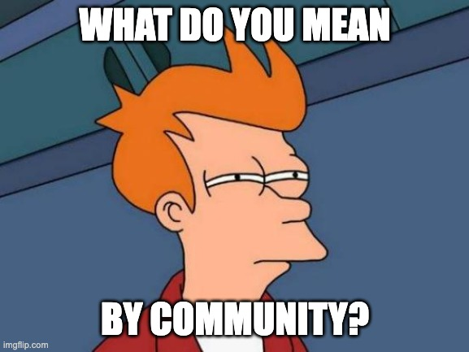

# Let's Write a Book About Community Together

I have an idea to write a book about communities, both in the Open Source world, and also in a much broader sense.

Rather than going off and writing the book, I want the process of generating and gathering ideas to take
advantage of community and to be participatory from the beginning.

Two minute introductory video about this repository:

[Have a look at the Community topic!](topics/community.md)

## Contribute Something You've Already Written

Everything in this repo is draft, pull requests are welcome to add raw markdown content, and anything else.

If you have done a talk, blog post, video, or anything else about community, I want to know about it. You can
contribute that by opening a pull request to add that item to `media.json`. If you are in the devrel world, if you are
a champion of someone else's open source community, or if you admire a creator, please add their stuff.

For more details, please see  [contributing to this repo](CONTRIBUTING.md)

## Be Interviewed: Contribute What's In Your Head

If you are a community professional, I am interested in talking to you. [Please contact me here](mailto:allen.m.david@gmail.com) and let's talk. I would want to interview you on a zoom call for a casual chat. That video is going to end up posted, and I would
add it to our list of media for later summarization.

## What do we have so far?

Check out the [Media List](_media/media-list.md) which is automatically updated.

## Wait, how are we going to write the book?

In phases. Here's the initial plan.  Phase 0 is already complete!

* **Phase 0: Initial Publishing**: get this idea out there, set the repo up with Github Pages so people can browse everything we subsequently do on the web.
* **Phase 1: Gather The Good Takes**: ask people to surface the best resources. Who had the smart takes? Let us know!
* **Phase 2: Summarize Themes**: Via code we'll add later, we can extract text from all of these resources,
and put full transcripts of those resources in this repo. That way, all of the good resources get indexed for Google, and all content irrespective of format becomes available for use with downstream LLM techniques.
* **Phase 3: Get Cracking**: here's where we write & edit the book together. This is something I want to do with all 
the inputs that we receive, but I'd love help.
